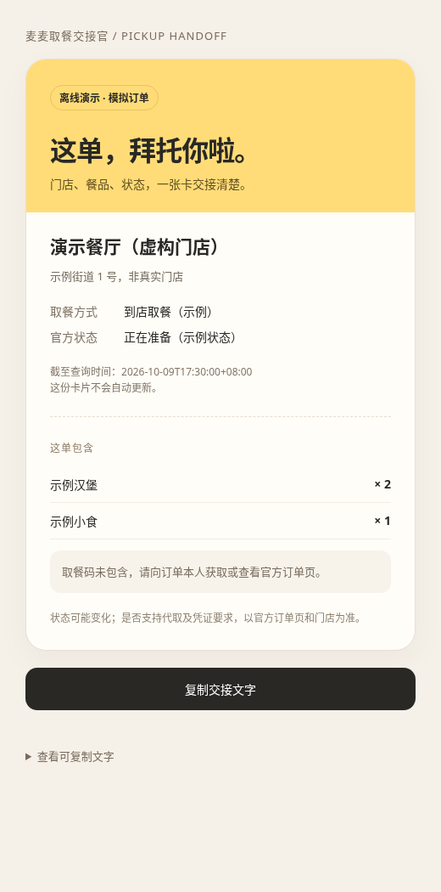

# 麦麦取餐交接官

**“我走不开，把这单整理给朋友代取。”**

一个基于麦当劳中国 MCP 的取餐交接 Skill。查询已选定的到店取餐订单，把门店、餐品、取餐方式和官方状态整理成一张交接卡，方便订单本人核对后发送给朋友。



[下载 Skill 安装包](packages/mcd-pickup-handoff-v0.1.0.zip) · [查看离线卡片 HTML](docs/demo.html) · [MCP 接入说明](MCP_INTEGRATION.md)

## 目标用户

- 正在开会、排队或暂时走不开，需要朋友帮忙取餐的人。
- 想把门店、餐品、订单状态整理清楚，减少来回询问的同事、同学和家人。
- 不想直接转发含订单编号、电话、付款链接等资料的完整订单截图的人。

## 作品的重点

- **找对这一单**：模糊的“刚才那单”先查询候选；有多笔时请用户选定，再查询订单详情。
- **交接信息清楚**：门店、取餐方式、餐品数量、官方状态和查询时间集中展示。
- **按需分享凭证**：默认不包含取餐码；用户明确要求才加入文字取餐码。二维码本版不处理。
- **状态不误导**：原样展示官方状态，并标明查询时点；卡片不会自动刷新，也不保证他人可代取。
- **只读工具范围**：独立 MCP 客户端只允许 `order-list`、`query-order`、`now-time-info`。不会创建、取消或修改订单。

## 先看离线演示

需要 Python 3.10+，无需第三方 Python 依赖：

```sh
git clone https://github.com/Jay1023CN/mcd-pickup-handoff.git
cd mcd-pickup-handoff
python3 scripts/render_card.py examples/order.synthetic.json --output private/demo
```

打开生成的 `private/demo.html`，或复制 `private/demo.txt`。示例里的门店、餐品、状态、订单和凭证都是模拟数据，页面会明确标注“离线演示”。

如果要演示文字取餐码的呈现：

```sh
python3 scripts/render_card.py examples/order.synthetic.json --output private/demo-with-code --include-pickup-code
```

## 在 WorkBuddy 使用

1. 在 [麦当劳 MCP 平台](https://open.mcd.cn/mcp) 用自己的账户申请 MCP Token。
2. 按[比赛官方接入教程](https://github.com/M-China/mcd-developer-innovation-challenge#workbuddy-开发指南)，进入“专家·技能·连接器 → 连接器 → 自定义连接器 → 配置 MCP”，添加 `https://mcp.mcd.cn`，传输类型为 `streamablehttp`。
3. 配置文件见 [mcp-config.example.json](mcp-config.example.json)，只包含 `${MCD_MCP_TOKEN}` 占位符。只有客户端支持环境变量展开时才能直接使用；否则在客户端本地凭据配置中填写真实 Token。不要把占位符原样发送给服务器。
4. 在技能管理中上传上方 ZIP 安装包（顶层为 `SKILL.md`），开启技能和连接器。若当前客户端不支持 ZIP 导入，可在对话中明确让它读取本仓库 `SKILL.md` 和所引用的文件。
5. 发起对话：

   > 查一下我刚才的到店取餐订单，整理一张给朋友的交接卡，先不放取餐码。

   或：

   > 我选的是刚才确认的这笔订单，把文字取餐码放进给朋友的卡片。

工具参数和返回字段以当前连接器 schema 为准；Skill 通过白名单输入生成器输出卡片。真实订单文件和输出保存在忽略的 `private/` 目录。

## 独立连接官方 MCP

如果本地已经安全配置 `MCD_MCP_TOKEN`，也可以使用只读 CLI：

```sh
mkdir -p private
python3 scripts/mcp_readonly.py tools > private/read-tools.json
# 根据实际 tools/list schema 在本地创建 private/order-list.args.json
python3 scripts/mcp_readonly.py call order-list --args-file private/order-list.args.json > private/order-list.result.json
# 选定订单，再根据实际 schema 创建 private/query-order.args.json
python3 scripts/mcp_readonly.py call query-order --args-file private/query-order.args.json > private/order.result.json
```

接着按 [输入规范](references/input-format.md) 只提取需要的字段到 `private/handoff.json`：

```sh
python3 scripts/render_card.py private/handoff.json --output private/friend-card
```

CLI 不内置工具参数模板、不猜订单字段映射。原始订单响应可能包含个人信息，不能放进公开仓库。

## 验证与当前状态

```sh
python3 -m unittest discover -s tests -v
python3 scripts/package_skill.py
```

已完成本地生成器、只读客户端、离线演示和自动化测试。**当前未使用真实麦当劳 MCP Token 联调，未在 WorkBuddy 中实际开发/验收，尚未提交报名。** 离线示例与测试不会被作为真实调用证据。详见 [验证记录](docs/VALIDATION.md)。

## 参赛材料

仓库包含 `README.md`、官方原版 `CONTEST_DECLARATION.md`、`MCP_INTEGRATION.md`、环境变量配置示例和可运行内容。真实 MCP 联调完成后才能如实提交报名；申请 WorkBuddy 专项奖励还需要真实使用 WorkBuddy 并导出脱敏对话为根目录 `workbuddy.md`，本仓库不生成虚构对话。

[报名草稿](docs/REGISTRATION.md) · [官方比赛规则](https://github.com/M-China/mcd-developer-innovation-challenge/blob/main/activityGuidelines.md) · [来源与同类调研](docs/SOURCES.md)

这是独立社区作品。是否支持他人代取、取餐凭证要求、订单状态和餐品供应以官方渠道和门店为准。

## 目录

```text
SKILL.md                     Skill 工作流程
scripts/render_card.py       白名单卡片生成器
scripts/mcp_readonly.py      官方 MCP 只读客户端
scripts/package_skill.py     安装包生成器
references/                 输入规范与工具说明
examples/                   明确标注的模拟订单
tests/                      字段过滤、渲染与 MCP 边界测试
docs/                       演示、验证记录、引用和报名草稿
packages/                   可下载的 Skill ZIP
```

项目自己的代码和文档采用 MIT 许可；原样复制的官方参赛声明及第三方服务不受本项目许可授权。来源说明见 [SOURCES.md](docs/SOURCES.md)。
