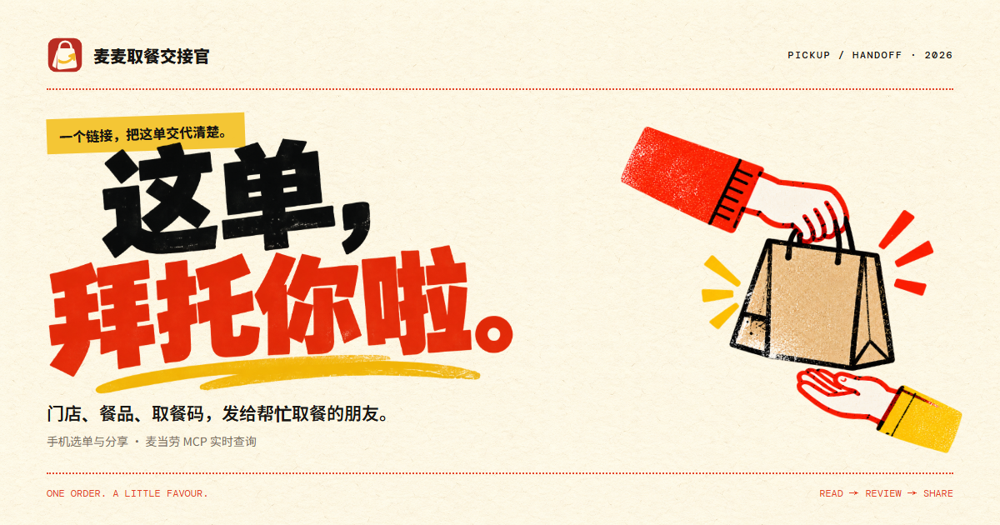
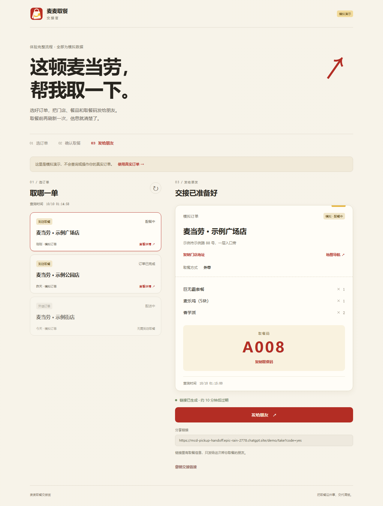

# 麦麦取餐交接官

临时走不开，让朋友帮忙取麦当劳，最麻烦的是把订单交代清楚：哪家店、几份餐、取餐码是多少，现在能不能取。

麦麦取餐交接官把这些信息放进一个手机链接。选好订单，发给朋友；朋友打开就能看门店、餐品和取餐码，到店前再点一下刷新。信息直接从麦当劳 MCP 查询，省去截图、抄码和来回解释。

[打开手机网页](https://mcd-pickup-handoff.epic-rain-2778.chatgpt.site/) · [体验演示](https://mcd-pickup-handoff.epic-rain-2778.chatgpt.site/demo) · [Windows 免安装连接器](packages/mcd-pickup-handoff-windows-v0.5.0.zip) · [Skill 与源码包 v0.5.0](packages/mcd-pickup-handoff-v0.5.0.zip) · [参赛报名 #128](https://github.com/M-China/mcd-developer-innovation-challenge/issues/128)

正在开会、排队，或者朋友正好路过门店，一次交接就够了。官方返回取餐码时默认带上，也可以隐藏。朋友能直接反馈“我来取／我到店了／已帮你取好”，你在最近交接里就能看到；需要时还能找回链接或撤销。



演示使用模拟订单，无需登录。实际使用读取自己的麦当劳订单，朋友只看到分享给他的这一笔。

[看 44 秒操作演示](https://mcd-pickup-handoff.epic-rain-2778.chatgpt.site/watch.html)：手机选单、生成带码链接、朋友查看并反馈取好。视频全程标注模拟数据，无音频。

## 手机使用

Windows 使用免安装连接器，无需安装 Python。电脑连接一次后，选单和分享都在手机网页完成。

1. 下载上面的 Windows 免安装包并解压，Token 从[麦当劳 MCP 平台](https://open.mcd.cn/mcp)申请。
2. 双击“麦麦电脑连接器.exe”，在连接窗口里保存 Token，点击“启动连接”和“打开手机入口”。
3. 用手机扫描连接窗口里的二维码，或在手机网页输入临时配对码。不用注册账号。
4. 配对后选择到店订单，确认后生成交接链接。另一部手机也可以用电脑新生成的配对码连接。
5. 点击“发给朋友”。朋友无需登录，打开链接即可查看，到店前可再刷新一次。

朋友页可复制取餐码和门店地址、打开地图导航。取好后点“已帮你取好”，双方页面收起旧码；朋友反馈与官方订单状态分开展示。

官方返回取餐码时，交接卡默认带上；取消勾选即可隐藏。没返回时显示“暂无取餐码”。订单编号、手机号、付款链接和配送地址不放进卡片。

生成和刷新都会重新查询订单。交接链接十分钟有效，可随时撤销；订单已完成、取消或信息发生变化时收起旧码。已完成、未支付、配送和无法识别状态的订单不能生成待取餐交接。

MCP Token 留在电脑，不上传网页或 GitHub，也不会打进包。免安装版保存在当前 Windows 用户的本机数据目录，源码版使用项目 `.env`。电脑连接器只向外发起 HTTPS 请求，无需开放电脑端口；使用时保持电脑连接在线。云端仅保存交接所需信息和临时任务，按配对身份隔离。

关闭电脑窗口后，后台仍然连接；需要停止时，重新打开窗口点击“停止连接”。[电脑连接说明](docs/WINDOWS_CONNECTOR.md)包含更新和数据位置。源码版需要 Python 3.10+，双击 `打开电脑连接.pyw`；其他系统运行 `python3 scripts/mobile_bridge.py --pair`，无需第三方 Python 包。

取餐按官方订单页和门店要求办理。需要离线 HTML/TXT 时，可使用开发工作台 `start-local.cmd`；文件和截图不能在线刷新。

## 在 Agent 中使用

安装包顶层包含 `SKILL.md`。在支持导入 Skill 的客户端中安装，并阅读[技能流程](SKILL.md)。例如：

> 把我刚才的麦当劳到店订单整理成链接，带上取餐码，我发给朋友。

客户端需能运行项目脚本并读取本机凭据。已配对时，Skill 可用 `publish_selection` 返回同样的手机交接链接。离线 JSON 生成器只用于模拟演示。

WorkBuddy 的 MCP 配置可参考 [mcp-config.example.json](mcp-config.example.json) 和[官方教程](https://github.com/M-China/mcd-developer-innovation-challenge#workbuddy-开发指南)。本项目尚未完成 WorkBuddy 验收。

## MCP 在这里做什么

| 工具 | 作用 |
| --- | --- |
| `order-list` | 读取账户订单，让用户选定要交接的一笔 |
| `query-order` | 查询门店、餐品、取餐方式、取餐码和最新状态；生成和刷新时再次核对 |
| `now-time-info` | 获取官方服务器时间，与本机查询时间一起留作核对 |

客户端仅允许这三个只读工具。前端不能提交门店、状态或取餐码来替代官方结果。[接入说明](MCP_INTEGRATION.md)记录了数据映射和校验方式。

## 演示与验证

```sh
python3 scripts/render_card.py examples/order.synthetic.json --output private/demo --include-pickup-code
python3 -m unittest discover -s tests -v
cd web
node --test tests/mobile-api.test.mjs tests/mobile-renew.test.mjs tests/mobile-session.test.mjs tests/mobile-progress.test.mjs tests/mobile-delivery.test.mjs tests/retention.test.mjs
cd ..
python3 scripts/package_skill.py
```

真实 MCP 的订单列表、详情和服务器时间查询已通过；当前验收账户的订单均已完成，历史订单会被拦截。手机完整交接流程另用模拟订单验证，真实待取餐订单仍需现场验收。[详细验证记录](docs/VALIDATION.md)

源码、测试、部署和凭据各有独立目录，见[项目文件管理](docs/PROJECT_LAYOUT.md)和[手机网页接入结构](docs/WEB_ARCHITECTURE.md)。

作品参加麦当劳程序员创意开发大赛，按公开 Star 排名。报名 #128 已获官方确认，成功参赛；欢迎点 Star 或提交使用反馈。

[参赛材料](docs/REGISTRATION.md) · [官方规则](https://github.com/M-China/mcd-developer-innovation-challenge/blob/main/activityGuidelines.md) · [来源与素材许可](docs/SOURCES.md)

项目代码和文档采用 MIT 许可；官方参赛声明及第三方素材遵循各自许可。
