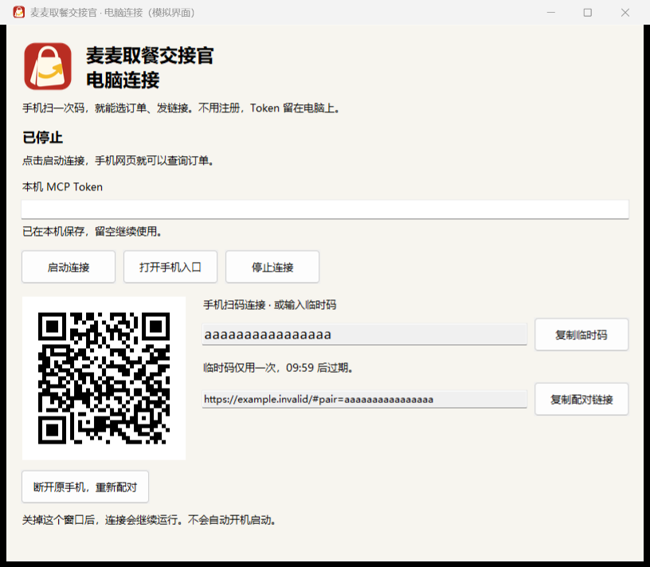

# 电脑连接一次，之后在手机上用

上图为模拟界面，临时码与二维码不连接真实账户。

Windows 用户下载 [免安装连接器 v0.5.0](../packages/mcd-pickup-handoff-windows-v0.5.0.zip)，解压后双击“麦麦电脑连接器.exe”。无需安装 Python，也不用输入命令。

1. 从 [麦当劳 MCP 平台](https://open.mcd.cn/mcp)取得自己的 Token，粘贴到电脑连接窗口。
2. 点击“启动连接”，再点击“打开手机入口”。
3. 用手机扫描窗口里的二维码。也可以打开[手机网页](https://mcd-pickup-handoff.epic-rain-2778.chatgpt.site/)，输入窗口里的临时配对码。
4. 选订单、生成链接、发给朋友，都在手机上完成。朋友打开链接即可查看，无需注册。

另一部手机需要访问自己的订单时，在电脑上新生成配对码即可；这会加入当前连接。只有明确点击重新配对，才会断开原手机和已有交接链接。

关闭连接窗口后，后台连接继续运行。暂时不用时，重新打开窗口点击“停止连接”。电脑关机或网络断开后，手机会显示离线；再次启动电脑连接器即可继续。

免安装版把 Token 和设备凭据存放在当前 Windows 用户的 `%LOCALAPPDATA%\McdPickupHandoff`。源码版继续使用项目内的 `.env` 和 `private/`，两个版本各自保管凭据，不会自动复制真实数据。更新时解压新包、停止旧连接，再打开新版；本机数据目录保留。

免安装包仅用于 64 位 Windows。它与源码版使用同样的三个只读 MCP 工具。二维码在本机生成，电脑只发起 HTTPS 请求；无需配置路由器或开放端口。

开发者可运行 `py -3 desktop/build_windows.py` 自行构建。构建依赖只安装到忽略的 `private/desktop-build/venv`，源码、资源和许可按白名单打包；构建记录保存在本机 `private/desktop-build/build-receipt.json`。
